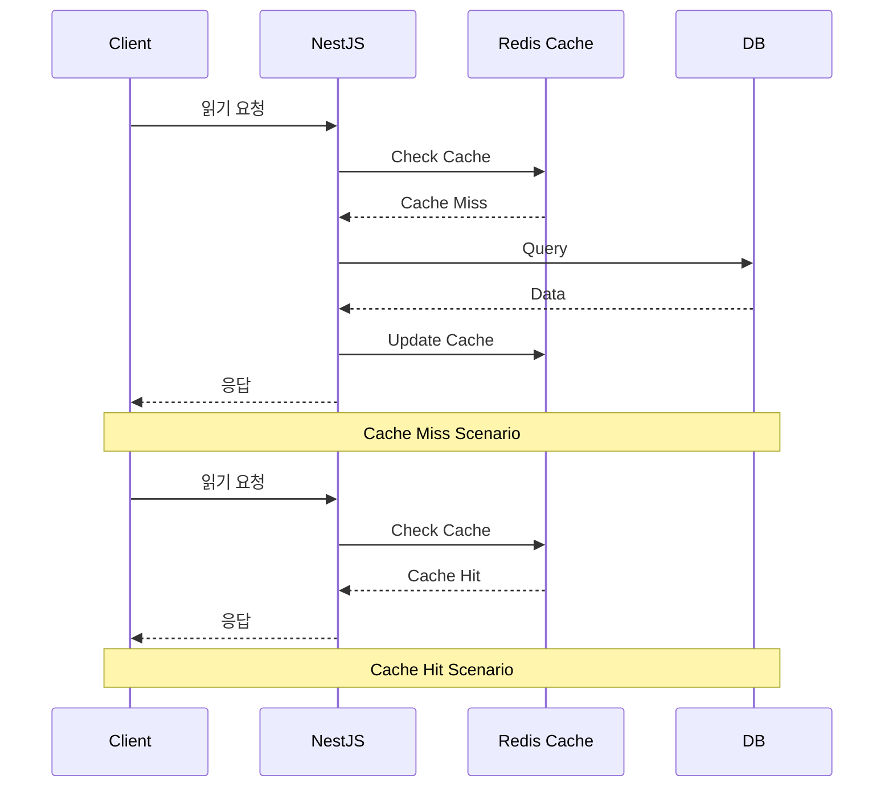
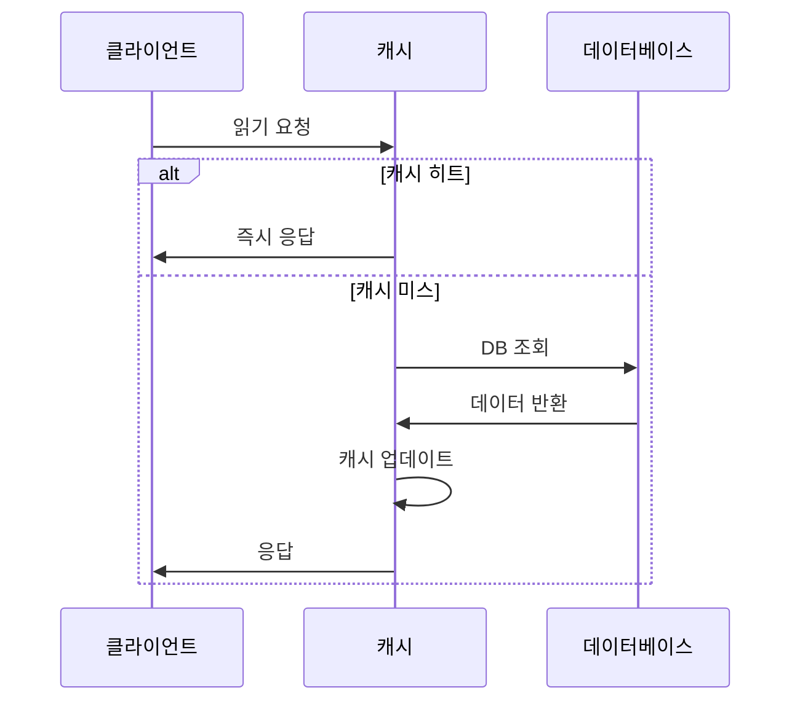
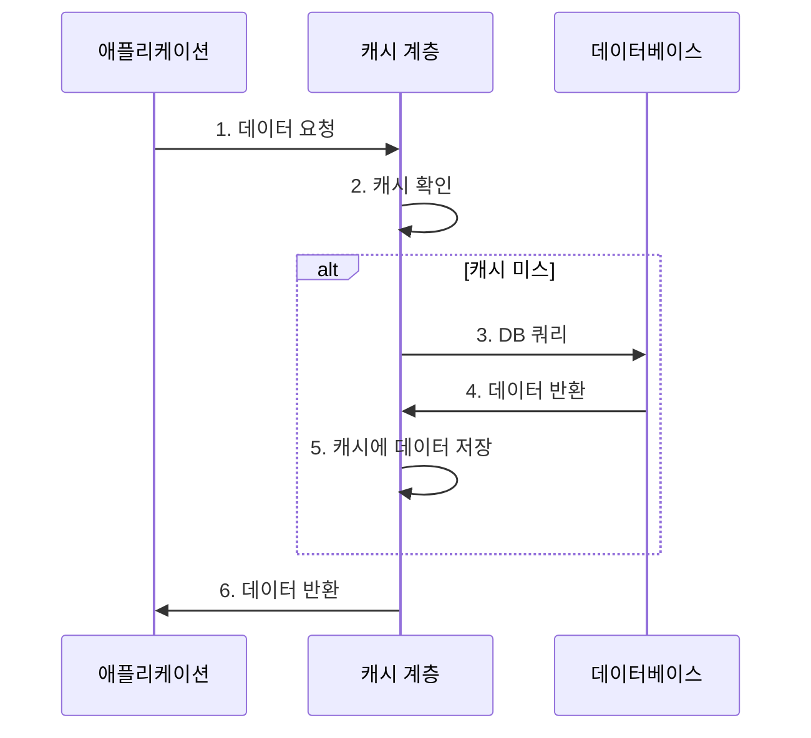
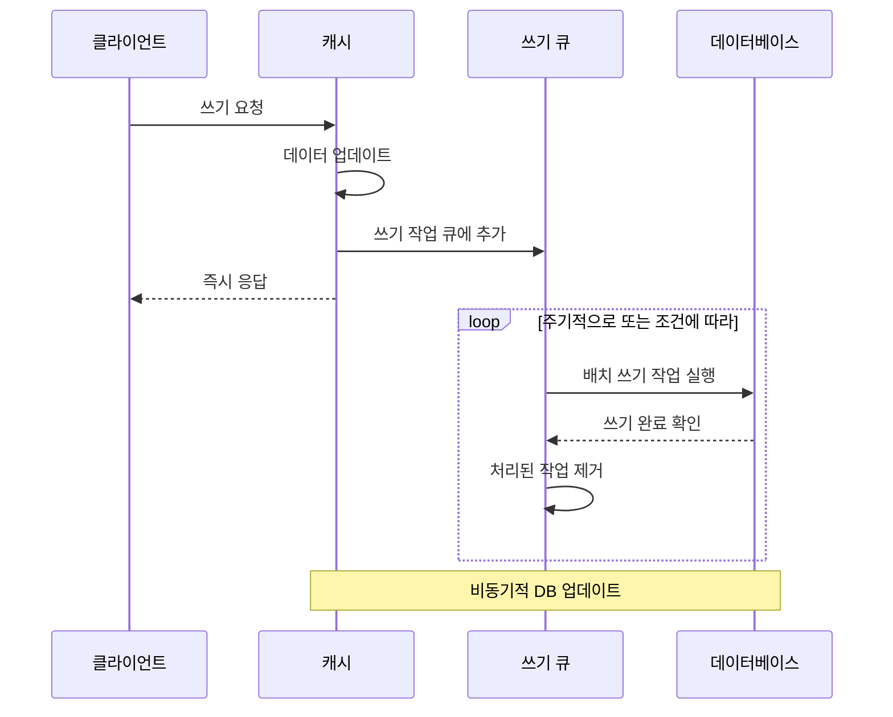
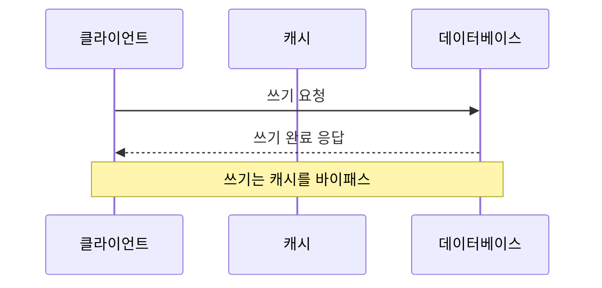

- [0. 분석](#0-분석)
  - [\[0.1\] 환경](#01-환경)
- [1. 캐시 전략](#1-캐시-전략)
  - [\[1.1\] Redis - 캐시 특성](#11-redis---캐시-특성)
  - [\[1.2\] 캐싱 전략 패턴 종류](#12-캐싱-전략-패턴-종류)
    - [(1) 캐시 읽기 전략](#1-캐시-읽기-전략)
      - [1. Cache Aside (Lazy Loading)](#1-cache-aside-lazy-loading)
      - [2. Read-Through](#2-read-through)
    - [(1). 캐시 쓰기 전략](#1-캐시-쓰기-전략)
      - [1. Write Back 패턴](#1-write-back-패턴)
      - [2. Write Around 패턴](#2-write-around-패턴)
- [2. 분석 대상](#2-분석-대상)
  - [\[2.1\] 캐싱 전략 적용](#21-캐싱-전략-적용)
    - [(1) Write Around + Cache Aside (Lazy Loading)](#1-write-around--cache-aside-lazy-loading)
  - [\[2.2\] 포인트 충전](#22-포인트-충전)
    - [(1). 테스트 환경](#1-테스트-환경)
    - [(2). 응답 시간 비교](#2-응답-시간-비교)
    - [(2). 처리량 비교](#2-처리량-비교)
    - [(3). 결과](#3-결과)
  - [\[2.3\] 포인트 조회](#23-포인트-조회)
    - [(1). 테스트 환경](#1-테스트-환경-1)
    - [(2). 응답 시간 비교](#2-응답-시간-비교-1)
    - [(3). 처리량](#3-처리량)
    - [(4) 분석 결과](#4-분석-결과)
- [3. 결론](#3-결론)
  - [\[3.1\] TODO](#31-todo)

## 0. 분석

캐시와 대기열 분석을 실행하였고, 자료분석과 자료분석을 적용한 분석 결과를 소개하려고 합니다.

### [0.1] 환경

| 종류     |                                   |
| -------- | --------------------------------- |
| 운영체제 | Ubuntu 24.04 LTS x86_64           |
| CPU      | AMD Ryzen 7 5800X (16) @ 3.800GHz |
| GPU      | NVIDIA GeForce RTX 3070           |
| RAM      | 32G                               |
| SSD      | 1TB                               |
| TEMP     | 27°C                              |

## 1. 캐시 전략

### [1.1] Redis - 캐시 특성

캐시는 백엔드 서비스 환경에서 시스템 성능 향상을 위하여 적용하는 기술로 메모리에 RAM 을 사용하기에 SSD/HDD를 이용하는 데이터베이스보다 상대적으로 빠른 속도를 가지고 서비스를 이용하는 사용자에게 쾌적한 사용을 제공할 수 있습니다. 하지만, 데이터 접근 시간이 빠를수록 비용이 늘어나기에 무한정 늘리기도 힘들어 주어진 적절한 가용 용량을 관리하는 캐시 전략을 세울 필요가 있다. 일정기간 동안 보존되어야 할 데이터를 캐시에 저장할 수 없다. `RAM의 특성(휘발성)` 때문에 데이터는 여전히 SDD/HDD 에 저장되어야 합니다.

자주 변경되는 SSD/HDD 데이터를 캐시 데이터를 사용하게 된다면 사용자가 데이터를 요청했을 때에, 데이터 정합성 문제가 현상이 자주 발생하여, 올바른 데이터를 제공하는게 힘들어져 오히려 캐시를 사용하지 않는 것이 좋습니다. 하지만, 자주 변경되지 않는 데이터라면 `Cache Hit` 현상이 자주 발생하여 데이터를 제공하는 시간이 줄어들게 됩니다. 따라서 `Cache Hit` 를 높이면서 `Cache Miss`를 줄이고, 데이터 정합성 문제가 발생하지 않도록 `캐시 읽기 전략`과 `캐시 쓰기 전략`을 생각할 필요가 있다.

> [!NOTE]
>
> - 데이터 접근 시간: CPU (레지스터 > 캐시) > RAM > SSD > HDD
> - 비용: CPU (레지스터 < 캐시) < RAM < SSD < HDD

### [1.2] 캐싱 전략 패턴 종류

#### (1) 캐시 읽기 전략

##### 1. Cache Aside (Lazy Loading)

사용자가 요청한 데이터가 우선 캐시에 있는지를 확인하고, `cache miss` 발생시에는 DB를 조회하며, 캐시를 업데이트하고, `cache hit` 발생시에는 DB를 조회하지 않고 캐시에 저장한 데이터로 응답을 합니다.

- 단점
  - 첫 요청 시 지연이 발생할 수 있음
- 장점
  - 필요한 데이터만 캐시에 저장이 된다.

##### 2. Read-Through

Cache-Adide와 비슷하며, 분기 처리하며 애플리케이션에서 DB에 접근하는 것이 아닌, 캐시 계층에서 DB 접근을 관리합니다. 캐시 관리를 중앙화하고 싶을 때, 주로 사용합니다.

- 장점
  - 애플리케이션 로직이 단순화되어 애플리케이션은 캐시만 알면 되고, 데이터베이스 접근 로직을 신경쓸 필요가 없게 됩니다.
  - 캐시 미스 시 데이터를 가져오는 로직이 한 곳에서 관리됩니다.
- 단점
  - 캐시 솔루션이 데이터베이스 연결 기능을 지원해야 합니다.
  - Redis 와 같은 솔루션이 작동하지 않을 경우, 가용성 문제가 발생하여 가용성 문제에 대한 솔루션이 필요합니다.

#### (1). 캐시 쓰기 전략

##### 1. Write Back 패턴

해당 패턴은 쓰기 작업을 모아두어 비동기적으로 DB에 쓰기 작업을 수행하는 패턴으로 많은 쓰기 처리량이 필요하고, 약간의 데이터 지연을 허용할 수 있는 시스템에 적합합니다.

- 장점

  - 클라이언트는 DB에 쓰기를 기다리지 않고, 즉각적인 응답을 받을 수 있습니다.
  - DB 업데이트는 백그라운드에서 비동기적으로 이루어집니다. 따라서, 여러 쓰기 작업을 모아서 한 번에 처리할 수 있어 DB 부하를 줄일 수 있습니다.

- 단점

  - 캐시가 갑자기 중단되면 아직 DB에 쓰이지 않은 데이터가 존재하여 읽기 작업이 중단될 수 있습니다.
  - 캐시와 DB 간의 일시적인 데이터 불일치가 존재할 수 있습니다.

##### 2. Write Around 패턴

Write Around 패턴은 데이터 쓰기 작업은 바로 캐시를 거치지 않고 데이터베이스에서 수행이 됩니다. 이 과정에서는 캐시가 업데이트가 되지 않고 클라이언트가 캐시에 읽기 요청을 보낼 때, 캐시 히트 시, 캐시된 데이터가 바로 반환되고, 캐시 미스 시, 데이터 베이스에서 데이터를 가져와 캐시에 저장한 후에 클라이언트에 반환이 됩니다.

- 장점

  - 모든 쓰기 작업이 캐시를 거치지 않아 캐시 부하가 줄어듭니다.

  - 캐시 업데이트 과정이 없어 쓰기 작업이 더 빠릅니다.

- 단점

  - 데이터가 수정될 때, 캐시에 쓰기 작업이 없으므로 데이터베이스 간의 불일치할 수 있습니다. 따라서 수정되거나, 삭제될 때, 캐시에 있는 데이터를 삭제하거나 TTL을 짧게 조정할 필요가 있습니다.

## 2. 분석 대상

`K6` 를 이용해서 부하테스트를 진행하였습니다.

### [2.1] 캐싱 전략 적용

#### (1) Write Around + Cache Aside (Lazy Loading)

- 적용 대상

  포인트 충전

- 이유

  캐시를 거치지 않고 쓰기 작업을 진행하는 `Write Around`의 쓰기 전략과 필요한 데이터만 캐시에 로드하여 메모리 효율성이 증가하고 캐시 미스 시 항상 최신 데이터를 유지하는 Cache Aside 방식을 최종적으로 선택하였고 캐시에 쓰기 작업이 없는 `Write Around`의 전략을 보완하여 쓰기 작업이 이루어진 경우 오래된 캐시 데이터를 삭제하는`Eviction` 정책을 수용하였습니다.

### [2.2] 포인트 충전

#### (1). 테스트 환경

- code: [저장소](https://github.com/cothi/CONCERT-TDD-API/blob/dev/test/performance/point-charge.js)

- 반복 횟수: 1000회

- 동시 사용자: 1명

#### (2). 응답 시간 비교

| 메트릭           | 캐시 적용 | 캐시 미적용 | 개선율                         |
| ---------------- | --------- | ----------- | ------------------------------ |
| 평균 응답 시간   | 2.64ms    | 2.61ms      | -1.1% (미미한 차이)            |
| 중간값 응답 시간 | 2.47ms    | 2.48ms      | 0.4% (미미한 차이)             |
| 최대 응답 시간   | 43.22ms   | 30.83ms     | -40.2% (캐시 미적용이 더 좋음) |

#### (2). 처리량 비교

| 메트릭 | 캐시 적용               | 캐시 미적용             | 개선율 |
| ------ | ----------------------- | ----------------------- | ------ |
| 처리량 | 367.558158 iterations/s | 372.034082 iterations/s | +1.2%  |

#### (3). 결과

두 테스트 모두 오류율 0% 로 모든 요청이 성공했고, 포인트 충전을 시에는 오래된 데이터를 삭제하는 `eviction`을 수행하기에 약간의 미미한 차이를 보였습니다.

### [2.3] 포인트 조회

#### (1). 테스트 환경

- code: [저장소](https://github.com/cothi/CONCERT-TDD-API/blob/dev/test/performance/point-query.js)

- 반복 횟수: 10,000회

- 동시 사용자(VUs): 1명

#### (2). 응답 시간 비교

| 메트릭           | 캐시 적용 | 캐시 미적용 | 개선율     |
| ---------------- | --------- | ----------- | ---------- |
| 평균 응답 시간   | 493.36µs  | 819.77µs    | 39.8% 향상 |
| 중간값 응답 시간 | 471.23µs  | 792.4µs     | 40.5% 향상 |
| 최대 응답 시간   | 13.58ms   | 20.99ms     | 35.3% 향상 |

#### (3). 처리량

| 메트릭 | 캐시 적용                | 미적용                  | 개선율     |
| ------ | ------------------------ | ----------------------- | ---------- |
| 처리량 | 1862.736775 iterations/s | 1153.34853 iterations/s | 61.5% 향상 |

#### (4) 분석 결과

두 테스트 모두 오류율 0% 로 모든 요청이 성공했고, 캐시 적용 시 응답 시간의 편자가 더 작고(안정적인 성능)을 보였습니다. 읽기 작업에 대한 캐시 효과가 명확히 드러나 시스템의 처리 용량이 크게 증가하였습니다.

## 3. 결론

생각한대로 결과가 나오긴 했지만, 포인트 충전에서 캐시를 삭제하는 로직을 추가해두어 그래도 어느정도는 차이점이 생길 것이라고 예상했지만 생각보다 차이가 나지 않아 예상과는 결과가 달랐습니다. 뭔가 기능을 추가할 때마다 고려해야 할 것들이 많아지지만 분석 결과 조회 분야에서 30% 이상의 성능 차이를 보인다면 많은 해결해야 할 문제점을 안고 데이터정합성 문제와 Cache Hit 확률을 올려서 쾌적한 서비스를 제공할 수 있지 않을까 생각합니다.

### [3.1] TODO

| 이슈                            | 설명                                                       | 해결 방안                                                       |
| ------------------------------- | ---------------------------------------------------------- | --------------------------------------------------------------- |
| 캐시 일관성 문제                | 캐시된 데이터와 실제 데이터 간의 불일치                    | - 짧은 TTL 사용 - 명시적 무효화 - 버전 기반 캐싱 적용     |
| 캐시 폭포 효과(Cache Avalanche) | 많은 캐시 항목이 동시에 만료되어 DB에 갑작스러운 부하 발생 | - 만료 시간에 작은 랜덤값 추가 - 분산 잠금 메커니즘 사용     |
| 캐시 관통(Cache Penetration)    | 존재하지 않는 키에 대한 반복적인 요청으로 DB 부하 발생     | - 널(Null) 결과도 캐싱 - 블룸 필터 사용                      |
| 핫키 문제(Hot Key)              | 특정 캐시 키에 대한 과도한 접근으로 캐시 서버 부하 발생    | - 키 분할 - 로컬 캐시 사용 - 캐시 계층화                  |
| 캐시 워밍업                     | 캐시 재시작 후 초기 성능 저하                              | - 사전 워밍업 스크립트 실행 - 점진적인 트래픽 증가           |
| 메모리 부족                     | 캐시 데이터 증가로 인한 메모리 부족                        | - 적절한 제거 정책 선택 - 캐시 크기 제한 - 분산 캐시 사용 |
