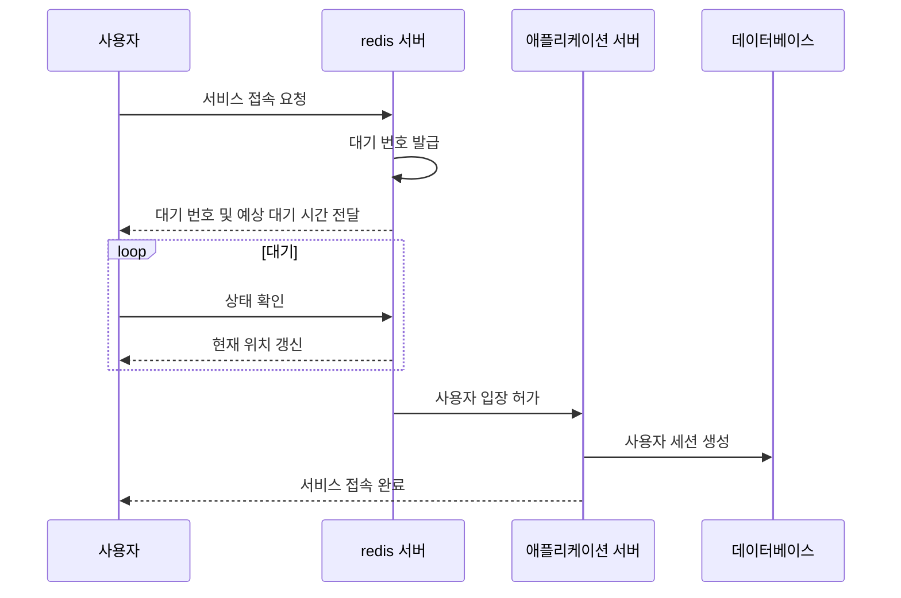

## 0. 개요

온라인 서비스에는 트래픽 관리는 중요한 과제이므로 트래픽이 몰리는 행사나 티켓 예매 시스템에서는 순간적으로 몰리는 사용자를 효과적으로 관리를 진행해야 합니다. 이를 위해서 우리는 놀이동산의 대기열 시스템에서 아이디를 얻어 대기열 시스템을 구현하고 분석했습니다. 먼 **구현 환경, 자료 조사 내용, 분석 결과를 통해서 글을 작성하려고 합니다.**


### [0.1] 구현 환경

| 종류     |                                   |
| -------- | --------------------------------- |
| 운영체제 | Ubuntu 24.04 LTS x86_64           |
| CPU      | AMD Ryzen 7 5800X (16) @ 3.800GHz |
| GPU      | NVIDIA GeForce RTX 3070           |
| RAM      | 32G                               |
| SSD      | 1TB                               |
| TEMP     | 27°C                              |

### [0.2] 분석 조건

Redis(Sorted Set)을 이용한 대기열과 단순히 비관적 락을 적용한 대기열을 비교를 통해서 처리량, 응답 시간을 비교하도록 합니다.


## 1. 대기열 전략

### [1.1] 놀이동산 대기열 모델

놀이동산에서는 인기 있는 놀이기구 앞에 대기줄을 만들어 순서대로 이용할 수 있도록 합니다. 해당 대기열 모델을 온라인 시스템에 전용한다면 아래와 같은 구조를 만들게 됩니다.

1. 사용자가 서비스에 접속하면 가상의 대기열에 입장
2. 각 사용자에게 고유한 대기 번호 부여
3. 서버의 처리 능력에 따라 순차적으로 사용자 입장 허용


### [1.2] Redis Sorted Set 개요

```bash
클라이언트
        |
        v
+-------------------+
|  애플리케이션 서버  |
+-------------------+
        |
        v
+-------------------+
|   Redis 서버       |
|                   |
| Sorted Set (대기열)|
|                   |
|  Score | Member   |
|  1000  | User1    |<--- 가장 오래 기다린 사용자
|  1001  | User2    |
|  1002  | User3    |
|  1003  | User4    |
|   ...  |  ...     |
|  1999  | User999  |<--- 가장 최근에 진입한 사용자
+-------------------+
        |
        v
+-------------------+
|   서비스 진입     |
+-------------------+

 처리 흐름:
 1. 새 사용자 진입 --> ZADD queue_name timestamp user_id
 2. 대기 순서 확인 --> ZRANK queue_name user_id
 3. 서비스 입장 처리 --> ZPOPMIN queue_name count
```

Redis를 이용하면 각각의 명령어를 통해서 진행이 가능합니다. 명령어 정리를 통해서 확인하도록 합니다.

#### (1) 정리

- Sorted Set은 대기열을 나타냅니다.
- 대기열 진입
  - 사용자가 서비스 접속 요청을하면, 애플리케이션은 `Redis Sorted Set`에 해당 사용자를 추가
  - `ZADD` queue_name timestamp user_id
- 대기 번호 부여
  - Sorted Set에 추가된 순서대로 자동으로 정렬
  - `ZRANK` queue_name user_id로 사용자의 현재 순위를 확인
- 서비스 입장 처리
  - `ZADD` 명령어를 이용하여 `active` 대기열에 입장을 처리합니다.


### [1.2] 전체적인 흐름



구현은 아래와 같이 작성하게 됩니다.

1. Redis를 활용한 대기열 구현
2. 실시간 대기 상태 업데이트
3. 공정한 대기열 관리를 위한 알고리즘 적용


## 2. 분석 결과

코드는 매번 유저가 각각 1회 대기열을 신청하고 자신의 대기열 위치를 확인하는 부하테스트를 진행했고, 생각보다 많은 개선율에 놀랐습니다. 

Redis는 인메모리 데이터 구조 저장소이기에 디스크 기반의 데이터 베이스 대신 메모리에 저장함으로써 접근 속도가 크게 향상되는 것을 확인했습니다.

테스트 결과는 아래의 도표와 같습니다.

**(1). 테스트 환경**

| 항목        | 내용   |
| ----------- | ------ |
| 반복 횟수   | 3000회 |
| 동시 사용자 | 1명    |

**(2). 응답 시간 비교**

| 메트릭           | Redis 미적용 | Redis 적용 | 개선율 |
| ---------------- | ------------ | ---------- | ------ |
| 평균 응답 시간   | 3.14ms       | 1.42ms     | 54.78% |
| 중간값 응답 시간 | 3.11ms       | 1.06ms     | 65.92% |
| 최대 응답 시간   | 43.57ms      | 15.43ms    | 64.59% |

**(3). 처리량 비교**

| 메트릭 | Redis 미적용            | Redis 적용              | 개선율  |
| ------ | ----------------------- | ----------------------- | ------- |
| 처리량 | 103.311226 iterations/s | 225.313704 iterations/s | 118.09% |

이 테이블들은 Redis Sorted Set 미적용과 적용 후의 성능을 비교하여 보여줍니다. 응답 시간과 처리량 모두에서 Redis 적용 후 상당한 개선이 있었음을 확인할 수 있습니다.


## 3. 결론

복합적으로 작용하여 대기열 시스템의 성능을 크게 향상시켰습니다. 특히 처리량이 2배 이상 증가하고 응답 시간이 절반 이상 감소한 것은 Redis의 고성능 특성이 대기열 관리에 매우 적합함을 보여줬습니다.